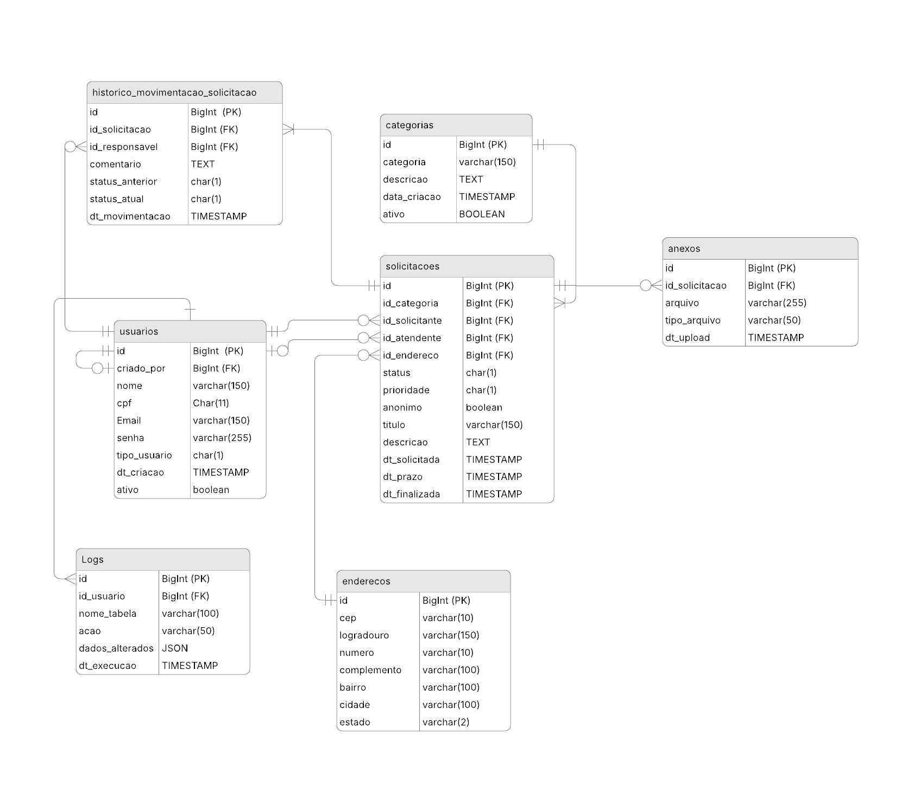

# 🏛️ ObservaAção
Sistema digital para registro e acompanhamento de solicitações de serviços públicos.

Projeto integrador com foco em:
- Transparência
- Redução de barreiras de acesso
- Rastreabilidade
- Manutenção sustentável

ODS relacionado: **ODS 16 — Paz, Justiça e Instituições Eficazes**

---

## 🎯 Objetivo

Criar um sistema simples que permita ao cidadão:
- Registrar solicitações (categoria, descrição, localização)
- Escolher envio identificado ou anônimo
- Acompanhar status e prazos
- Visualizar histórico de atendimento

E ao servidor/gestor:
- Organizar fila por prioridade, bairro e categoria
- Atualizar status com comentário obrigatório
- Manter rastreabilidade completa

---

## 👥 Perfis de Usuário

| Tipo | Código | Descrição |
|---|---|---|
| Cidadão | `C` | Abre e acompanha solicitações |
| Atendente | `A` | Puxa e executa solicitações da fila |
| Gestor | `G` | Aprova, rejeita, define prazo e prioridade |
| Administrador | `D` | Gerencia usuários, categorias, logs e dados anônimos |

### Permissões por perfil

#### Cidadão
- Pode fazer solicitações
- Lista apenas as próprias solicitações
- Acompanha o status das suas solicitações

#### Atendente (Servidor Público)
- Puxa solicitações aprovadas da fila por conta própria
- Lista solicitações que aceitou atender
- Adiciona observações quando houver atraso
- Finaliza solicitações concluídas
- ⚠️ **Não visualiza dados pessoais de solicitações anônimas**

#### Gestor
- Lista todas as solicitações
- Aprova ou reprova solicitações
- Define nível de prioridade
- Estipula prazo para atendimento
- ⚠️ **Não visualiza dados pessoais de solicitações anônimas**

#### Administrador
- Cria e exclui usuários (Cidadão, Atendente e Gestor)
- Cadastra, ativa e desativa categorias
- Visualiza logs do sistema
- ✅ **Pode visualizar dados de solicitações anônimas**
- ⚠️ ADM raiz é cadastrado diretamente no banco (seed); novos ADMs só podem ser criados por outro ADM

---

## 🔄 Fluxo de Status

```
AGUARDANDO_APROVACAO
        ↓               ↓
    APROVADA         REJEITADA
        ↓
AGUARDANDO_ATENDENTE
        ↓
   EM_ANDAMENTO
        ↓
    FINALIZADA
```

- **AGUARDANDO_APROVACAO** → solicitação recém-criada pelo cidadão
- **APROVADA** → gestor aprovou, definiu prioridade e prazo
- **AGUARDANDO_ATENDENTE** → aguardando atendente puxar da fila
- **EM_ANDAMENTO** → atendente aceitou e está executando
- **FINALIZADA** → atendente concluiu o serviço
- **REJEITADA** → gestor reprovou a solicitação

Cada mudança de status é registrada em `movimentacao_solicitacao` com data, responsável e comentário obrigatório.

---

## 🗄️ Banco de Dados

### Diagrama
<p align="center">
  
</p>

---

## 🔒 Regras de Anonimato

| Situação | id_solicitante |
|---|---|
| Solicitação identificada | id do cidadão |
| Solicitação anônima | NULL |

| Perfil | Vê dados pessoais de anônimos? |
|---|---|
| Cidadão | ❌ |
| Atendente | ❌ |
| Gestor | ❌ |
| ADM | ✅ |

---

## 🧠 IHC — Perfis e Personas

Perfis obrigatórios:

1. **Cidadão com baixa familiaridade digital**
   (PREENCHER resumo + 3 personas)

2. **Cidadão em situação de vulnerabilidade / receio de retaliação**
   (PREENCHER resumo + 3 personas)

3. **Servidor público / gestor**
   (PREENCHER resumo + 3 personas)

Cada persona deve conter: contexto social/digital, dores, objetivos, restrições, acessibilidade e medos.

---

## ⚙️ Regras Críticas

**Anonimato:**
- Não exige dados pessoais do solicitante
- Endereço do problema é sempre obrigatório (independente de anonimato)
- Atendente e Gestor não visualizam dados pessoais de anônimos
- Apenas o ADM tem acesso completo para fins de auditoria

**Prioridade:**
- Definida pelo Gestor no momento da aprovação
- Impacta a ordem da fila de atendimento
- Níveis: Baixa, Média, Alta, Urgente

**Prevenção de abuso:**
- Campos obrigatórios com validações
- Todas as ações sensíveis são registradas em `logs`
- Rastreabilidade completa via `movimentacao_solicitacao`

---

## 💻 Versão Beta (1º Bimestre)

- **Linguagem:** Java
- **Interface:** (PREENCHER — CLI ou UI simples)
- **Persistência:** Banco de dados relacional — PostgreSQL

### Classes principais
- `Usuario`
- `Solicitacao`
- `Categoria`
- `Endereco`
- `MovimentacaoSolicitacao`
- `Anexo`
- `Log`
- `FilaAtendimento`
- `ServicoSolicitacoes`

### Funcionalidades mínimas
- Criar solicitação (identificada ou anônima)
- Listar solicitações
- Buscar por protocolo
- Atualizar status com comentário obrigatório
- Registrar movimentação

---

## 🧹 Clean Code

Relatório analisando 3 funções:
- (PREENCHER)
- (PREENCHER)
- (PREENCHER)

Práticas aplicadas:
- Nomes significativos
- SRP (Single Responsibility Principle)
- Métodos curtos
- Tratamento de erros
- Separação de responsabilidades

---

## 🚀 Como Rodar o Projeto

### Pré-requisitos
- Java instalado
- PostgreSQL instalado e rodando
- Git instalado

### Passo a passo

**1. Clone o repositório**
```bash
git clone https://github.com/H4ttiz/Observa-aep.git
cd Observa-aep
```

**2. Crie o banco de dados**

No PostgreSQL, crie um banco com o nome:
```sql
CREATE DATABASE observa_aep;
```

**3. Configure as credenciais**

Abra o arquivo `src/main/resources/application.properties` e altere com o seu usuário e senha do PostgreSQL:
```properties
db.url=jdbc:postgresql://localhost:5432/observa_aep
db.user=SEU_USUARIO
db.password=SUA_SENHA
```

**4. Execute os scripts SQL manualmente**

Os scripts ficam em `src/main/resources/db/` e devem ser rodados na ordem no seu PostgreSQL:
```
V1__CREATE_TABLE.sql   → criação das tabelas
V2__INSERT_TABLE.sql   → dados iniciais (seed)
...
```

Você pode executar pelo terminal do PostgreSQL ou por uma ferramenta como DBeaver/pgAdmin.

**5. Rode o projeto**

Execute a classe principal pelo seu IDE (IntelliJ, Eclipse, etc.) ou via terminal:
```bash
javac Main.java
java Main
```

---

## 🎥 Entrega

- Link do GitHub (versão beta):
- Documento com perfis + relatório clean code:
- Link do Vídeo:
- Tema escolhido: (PREENCHER)

---

## 👥 Integrantes

- Thiago Gimenes Santos
- Leonardo Bezerra da Silva
- Carlos Eduardo Carfi Silva

---

Status: Em desenvolvimento 🚧
Versão: v0.1-beta
